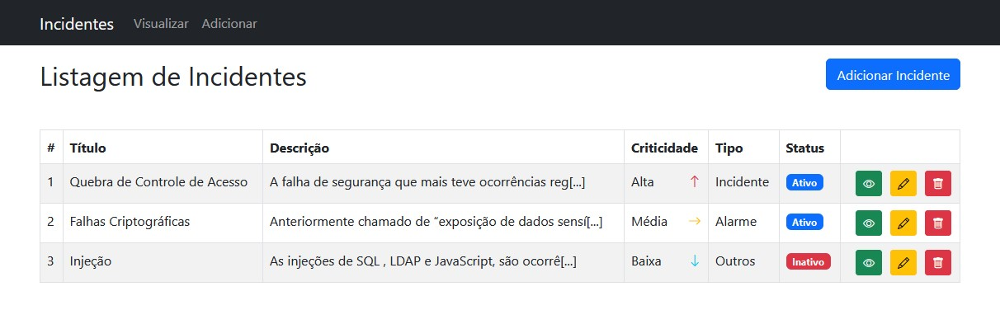

## CRUD SPA - React com Redux

Dashboard criado para fins de teste, contendo todas as operações de CRUD, consumindo uma [API](https://github.com/wesleysouza-dev/crud-incidents-laravel-api) desenvolvida em Laravel.

Foram utilizadas algumas bibliotecas/frameworks de apoio, como:

- Bootstrap v5.2 / Bootstrap Icons;
- React Notifications;
- Redux;
- Axios.



#### 1) Configuração inicial

Como o dashboard consome uma API externa, é necessário configurar a URL base para realizar as requisições. Para isso, configure o arquivo **.env** que se encontra na raiz do projeto.

.env

```
REACT_APP_API_HOST = http://localhost:8989/api/incidents
```

<sub>_[Clique aqui](https://github.com/wesleysouza-dev/crud-incidents-laravel-api) para acessar o repositório da API._</sub>

#### 2) Instalando as dependências

Acesse o diretório raiz da aplicação e via terminal execute o comando abaixo:

```
npm install
# or
yarn install
```

#### 3) Inicializando a Aplicação

Para rodar a aplicação em modo de desenvolvimento, via terminal execute o comando abaixo:

```
npm start
# or
yarn start
```

Automaticamente o projeto será aberto em uma aba do seu browser padrão.

Até a próxima :)!!

[](https://wesleysouza.dev)
